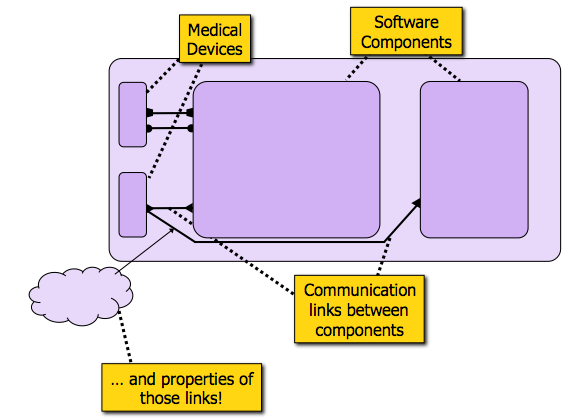
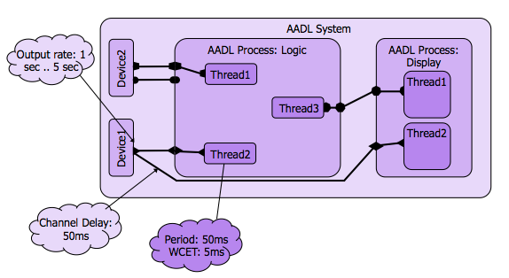
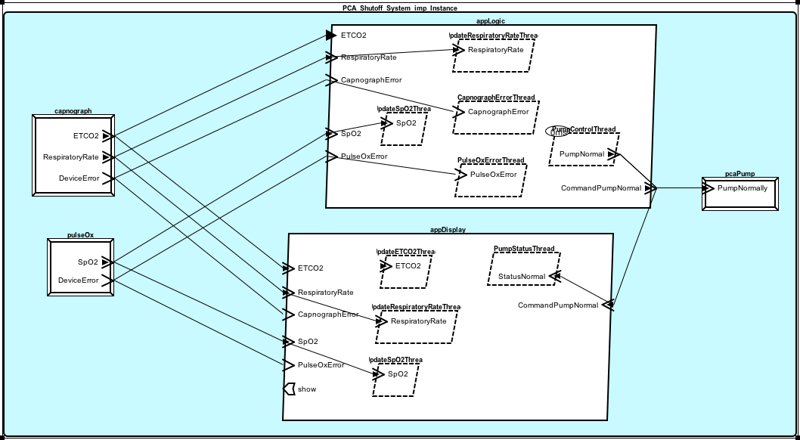

.. include:: ../util/substitution.rst

Modeling the PCA Infusion System
################################
Models are a powerful way of designing a system, and, by giving the big picture,
of conveying its structure. If expressive enough, a modeling language can also
provide a means of performing analyzes. |AADL|, the Architectural Analysis and 
Design Language, is expressive and precise enough for such tasks. This section 
explores existing AADL models of the PCA Infusion System.

The System and its Components 
*****************************
AADL uses a component-and-connector viewtype (C&C) for representing 
architectures. As such, it presents a system as a hierarchy of components that 
express runtime behavior; wherein a component is one of the principle
processing units of the executing system, and a connector is a mechanism by 
which components interact.

    Components and Connectors of the PCA Infusion System
    
Above can be seen five component blocks that are connected with communication 
links over which they can interact. The yellow labels give an idea of the
intended purpose for each box and their connections. The notion of
characterizing each element with properties is also alluded to. 
    
.. The system for overseeing, and possibly shutting down operation of a PCA
.. infusion pump in a clinical setting is configured by a medical software 
.. application. This **app** interfaces with three *pseudo* medical devices: a PCA 
.. pump, a pulse oximeter, and a capnography. The AADL models that specify all 
.. these components are described in this section.

The System Expressed in AADL
****************************

    Caption
    
The architectural analysis and design language (|AADL|) models real-time, 
embedded systems as a hierarchy of components with a component and connector 
architectural style. The language supports the specification of data, control, 
and error flows, as well as both discrete and continuous behaviors. AADL and
its extending **annexes** bring with them model analysis and simulation 
capabilities.

The models that specify the app configured shut-off system can be divided into 
two broad classes: those that describe the app itself, and those that model the 
devices it interacts with to accomplish its goals. The following subsections
elaborate on each.

Medical App Models
******************

    
    Caption

PCAShutoffApp.aadl
==================
**Structure and Rationale**

logic.aadl
----------

display.aadl
------------

Pseudo Medical Devices
======================
**Medical device interfaces**    

.. **File Types**

.. * Device interfaces

.. **Generated File Types**

.. * Port payload types
.. * Eclipse project file
.. * Requirement matching XML (App doesn't interface correctly with generated models??)  

Medical Device Models
*********************
.. Strictly speaking, needs the interfaces...
.. (App requirements and device matching??)

.. (Generated files??)

.. The *Shutoff App* system obviously needs a PCA pump to control. The only 
.. capability beyond normal functionality it is required to possess, is a command
.. port through which a signal may shut it off.

.. In addition to the pump, the app requires these measures of patient 
.. physiological parameters: SpO2, EtCO2 and respiration rate. In the demo 
.. implementation of the *end-to-end scenario*, the first requirement is satisfied 
.. by a pulse oximeter device, and the remainder by a capnography device.

.. **File Types**

.. * Devices

PCAShutoffApp_pulseox.aadl
==========================
**Structure and Rationale**

PCAShutoffApp_capnog.aadl
=========================
**Structure and Rationale**

PCAShutoffApp_pcapump.aadl
==========================
**Structure and Rationale**

.. Port Payload Types
.. ==================

.. Requirements (XML)
.. ==================

.. Eclipse Project File
.. ====================

.. Existence of pump with stop action, SpO2, EtCO2, respiration rate measures.
.. Pseudo devices
