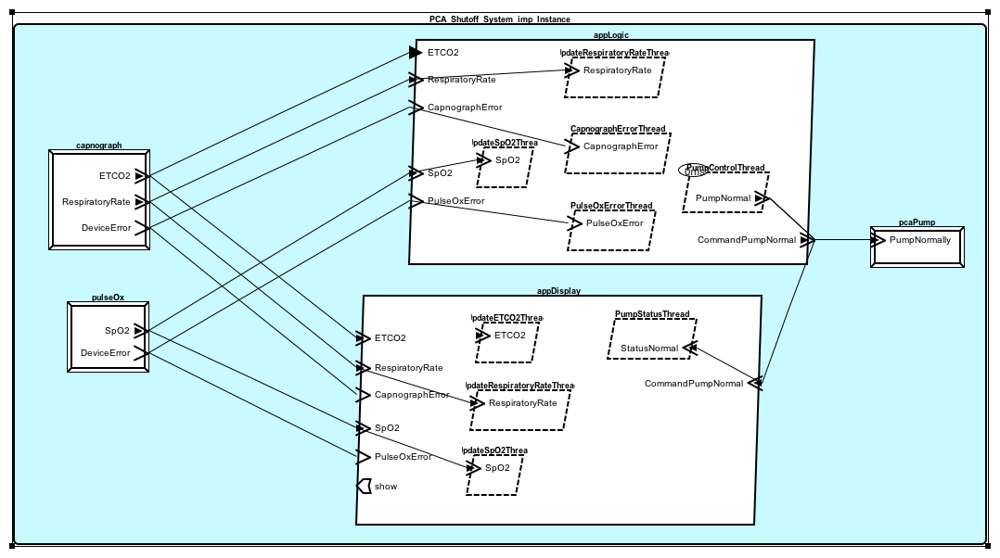

.. include:: ../util/substitution.rst

Modeling the PCA Infusion System
################################
Models are a powerful way of designing a system, and conveying its structure. 
An expressive modeling language can also provide means for analyzing a system 
as its design evolves. |AADL|, the Architectural Analysis and Design Language, 
is expressive and precise enough for such tasks---AADL and its extending
**annexes**  bring with them model analysis and simulation capabilities.

AADL is meant for modeling real-time, embedded systems. The language supports 
the specification of data, control, and error flows, as well as both discrete 
and continuous behaviors. This section explores the AADL models of the PCA 
Infusion System.

The System and its Components 
*****************************
AADL uses a component-and-connector (C&C) viewtype for representing 
architectures. As such, it models a system as a hierarchy of runtime units: with 
a component being one of the principle processing units of the executing 
system, and a connector being a mechanism by which these components interact.

    Components and Connector Structure of the PCA Infusion System
    
Above can be seen five component blocks that are connected with communication 
links over which they can interact. The yellow labels give an idea of the
intended purpose of the boxes and their connections. The notion of
characterizing elements with properties is also alluded to. 

    
The System Expressed in AADL
****************************
The ambiguous boxes and arrows of the preceding diagram have been typed
with AADL component categories below, thus giving them meaningful semantics. 
Some concrete properties are also shown as being added.

.. figure:: images/app-comps&props(inst).png
    :alt: Instantiation of app 
    :align: center

    Typed  & Characterized Elements of the PCA Infusion System
    
The two system software components have been identified as processes. That 
is, as memory address spaces representing compiled code and data that are 
protected at runtime. **Processes**, **threads**, and **data** are the principle
runtime software abstractions in AADL. Note that our design does not yet need
to concerned itself with platform issues, so no system memory or processors have
been defined, and the PCA Infusion System's software components are said to be
*unbound*.

The functionality and responsibilities required of the processes have been 
partitioned into thread subcomponents: three in the logic process, and two in 
the display process. A thread represents a sequence of executing code. Here they
are shown as communicating between the processes, and with devices.

A **device** in AADL is a simple or complex abstraction of a components, either
internal and external. They consist of only those characteristics necessary for
for analysis and unambiguous representation. The devices in the typed system
diagram are not real medical devices, instead they are just interfaces. And they 
aren't real interfaces; they are interfaces to *pseudo devices*. 

.. Aren't real devices, just i/f. Aren't even real i/fs!

.. The models that specify the app configured shut-off system can be divided into 
.. two broad classes: those that describe the app itself, and those that model the 
.. devices it interacts with to accomplish its goals. The following subsections
.. elaborate on each.

.. This **app** interfaces with three *pseudo* medical devices: a PCA 
.. pump, a pulse oximeter, and a capnography. The AADL models that specify all 
.. these components are described in this section.

Medical App Models
******************

    
    Caption

PCAShutoffApp.aadl
==================
**Structure and Rationale**

logic.aadl
----------

display.aadl
------------

Pseudo Medical Devices
======================
**Medical device interfaces**    

.. **File Types**

.. * Device interfaces

.. **Generated File Types**

.. * Port payload types
.. * Eclipse project file
.. * Requirement matching XML (App doesn't interface correctly with generated models??)  

Medical Device Models
*********************
.. Strictly speaking, needs the interfaces...
.. (App requirements and device matching??)

.. (Generated files??)

.. The *Shutoff App* system obviously needs a PCA pump to control. The only 
.. capability beyond normal functionality it is required to possess, is a command
.. port through which a signal may shut it off.

.. In addition to the pump, the app requires these measures of patient 
.. physiological parameters: SpO2, EtCO2 and respiration rate. In the demo 
.. implementation of the *end-to-end scenario*, the first requirement is satisfied 
.. by a pulse oximeter device, and the remainder by a capnography device.

.. **File Types**

.. * Devices

PCAShutoffApp_pulseox.aadl
==========================
**Structure and Rationale**

PCAShutoffApp_capnog.aadl
=========================
**Structure and Rationale**

PCAShutoffApp_pcapump.aadl
==========================
**Structure and Rationale**

.. Port Payload Types
.. ==================

.. Requirements (XML)
.. ==================

.. Eclipse Project File
.. ====================

.. Existence of pump with stop action, SpO2, EtCO2, respiration rate measures.
.. Pseudo devices
