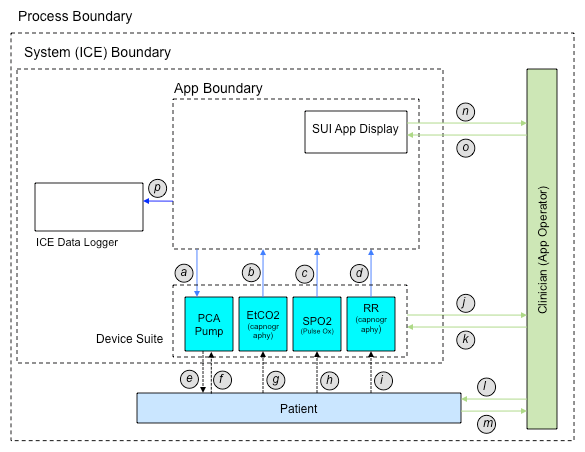
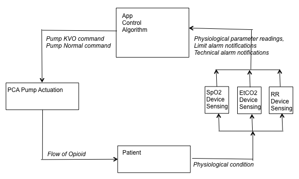

.. include:: ../util/substitution.rst
.. _shutoff_app:

###########################
The PCA Shutoff Application
###########################
The Integrated Clinical Environment is architected to be a "system of systems" 
of which the PCA Shutoff App is but one of many possible hosted systems. As a
program running on the |ICE| Supervisor---a reusable infrastructure component 
of the ICE---the App can designate its needs and have the Supervisor pull 
together an *interoperable* system of medical devices for its use, instead of 
having to cobble together an ad hoc network of stand-alone devices on its own. 
By doing so, the App also gains input and output functionality through the 
Supervisor's user interface (SUI), and access to the ICE communication channels 
via transparent middleware.     

.. Why relevant, why this example?

**************************
PCA Shutoff App in Context
**************************
One conceivable instance of a system that the ICE Supervisor could construct 
based of requirements given it by the PCA Shutoff App, is pictured here in
a clinical environment. 

    
    ICE Instantiation of PCA Safety Interlock App with Context Interactions

The clinical context is delimited by an outermost *process boundary*. Besides
the ICE system---shown within the *system boundary*---it includes a clinician and 
a patient who both interact with the system: the clinician either through the 
Supervisor UI as configured by the App, or through the front panels of the PCA 
pump and monitoring devices; the patient through the pump's drug dispenser, and 
his physiological responses as sensed by the various monitors. Finally, the 
clinician and patient can be seen to interact with each other.

PCA Usage and Shutoff
=====================
The shutoff system itself consists of the PCA Shutoff App, a suite of medical 
devices, and the ICE Data Logger. The Logger, which is fed data from the App, is 
for audit purposes, and need not be considered further. The App interacts with 
its *device suite* by sending commands to the PCA Pump, and acquiring
physiological measurements from the monitors. It uses the SUI to display these
values along with results of any trend analyses, to set off alarms, and to 
summarize the state of alarm and infusion conditions.

The clinician sets up and initializes the system by running the PCA Shutoff
App, and entering operating values. These values do things like enable on-demand
pump infusion, and set dosage limits and alarm levels. Once attached to the 
probes and sensors of the system's medical devices, the patient is given an
actuator for signaling his desire for a bolus of pain relieving medication.

From this point on, the app oversees the pump's administration of its opoid, all
the while watching for deteriorating patient respiratory health as indicated by
physiological measurements of blood oxygen saturation (SpO2), end-tidal carbon
dioxide (EtCO2), and respiratory rate (RR). If values and/or trends for these 
physiological parameters indicate the onset of respiratory depression---a sign
of possible drug overdose---the system gives out both audible and visual alarms. 
Should respiratory health signs continue to deteriorate, the system safety 
interlock will be tripped, halting the pump's infusion.

.. The condition for halting the pump in this manner is referred to as the halt condition.

.. One thread in the app process is responsible for controlling the pump, while
.. others are responsible for detecting deteriorating patient respiratory 
.. health---a sign of possible drug overdose.

.. These monitoring algorithms are associated with the monitoring devices, and
.. use the physiological measurements of blood oxygen saturation (SpO2), 
.. End-Tidal carbon dioxide (EtCO2), and respiratory rate (RR) obtained by, in 
.. the illustrated system instance, pulse oximeter and capgnography devices. 
.. When values and/or trends for these physiological parameters indicate a
.. possible onset of respiratory depression, the system gives out both audible 
.. and visual alarms. The condition for enunciating these alarms is referred to 
.. as the alarm condition.

 
Shutoff App as a Control Loop
=============================
An examination of the signals flowing between components of the context diagram
reveals many loops. From a functional point of view it can be useful to view
such flows as classical control loops. Additionally, identification of these
loops anticipates supporting |STPA|.

The loop of most interest to us runs from the app, through the PCA pump, to the
patient, back through the monitors, and returns to the app. Abstracting function 
out of this context leads to the block diagram pictured here.

    
    PCA Infusion System Structured as a Control Loop

Each block is discussed in the subsections that follow, starting from the top
and proceeding around the loop in a counter-clockwise direction.

Controller & Process Model
--------------------------
The app functions as the *controller* for this loop: making decisions and 
sending out commands based on the feedback it receives. For its algorithms to be
able to make sound decisions, the app needs to maintain a *process model*. That
is, its take on what is happening within the system, and any affects it has had
on the external world. In the case of the Shutoff App, this amounts to knowing
the state of the system, and maintaining a memory of patient physiological 
metrics from which respiratory health trends may be calculated. The app makes 
various views of its process model available on the SUI display.    

Actuator
--------
To effect its goals, the app exercises control over the PCA pump by enabling or
disabling its ability to infuse a drug. It does this with signals it sends out
to the pump through a command port. Thus, the PCA pump, responding to commands
it receives from the app, acts as the actuator for the system, regulating the
amount of drug that can flow in the system. 

Controlled Process
------------------
* patient

Sensors
-------
* Monitoring devices
* rr, spo2, etco2 feedback

.. * effectively collapsed them into one device
