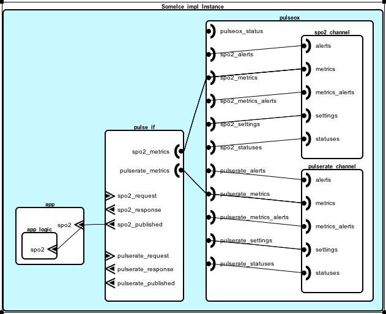

.. include:: ../util/substitution.rst
.. _comm_patterns:

#######################
Component Communication
#######################
* ICE vs. MDCF?

*****************************
Inter-Component Communication
*****************************

    Device to App Communication using Feature Groups
  
**Structure details for modeling a virtual medical device in AADL**

* AADL flattened to circumvent communication limitations for nested components
    * Mostly preserves DML hierarchy (no `vmds` map)
    * A DML channel in the `vmds` map is considered to be a virtual medical device
    * Channel interfaces combine to form the medical device's interface  
    * Channels are partition into coherent communication groups, or "sub-channels"
    * Design uses one AADL feature group for each sub-channel
* Stand-alone interface layer mediates between device and app
    * App, interface and device are three independent subcomponents of system 
    * Breaks device feature groups out into individual ports (group to port connections not shown)
* Example has app choosing between *get* and *periodic* exchanges for same metric
    * Get exchange maps to request­-responder SCP with device as responder
    * Periodic exchange maps to publisher­-subscriber SCP with device as publisher
* Pros
    * Interface satisfies app framework while maintaining device model traceability
    * App side of interface is independent of device's (except, perhaps for naming convention)
    * Entities of `pulse_if` are duplicates or inverses of those already defined in `pulseox`
* Cons
    * AADL nesting limitations require that each VMD become an AADL **system**
    * Component `app_logic` cannot see `pulse_if`; app must provide a port

************************************
Simple Communication Patterns (SCP)
************************************

**DML exchanges to SCP mapping**

* periodic -> publisher-subscriber
* sporadic -> publisher-subscriber
* get ­-> request-­responder
* set ­-> sender-­receiver
* action ­-> initiator-­executer

**Communication patterns in AADL**

* Publisher replaces server side of "Periodic" and "Sporadic" exchanges

.. literalinclude:: snippets/publisher-port.aadl
    :language: aadl

* Subscriber­ replaces client side of "Periodic" and "Sporadic" exchanges

.. literalinclude:: snippets/subscriber-port.aadl
    :language: aadl

* Requester replaces client side of "Get" exchange

.. literalinclude:: snippets/requester-port.aadl
    :language: aadl

* Responder­ replaces server side of "Get" exchange

.. literalinclude:: snippets/responder-port.aadl
    :language: aadl

**Notes**

Exchanges may be bidirectional, but the MDCF device programming model only
supports unidirectional data movement. 
(Yu Jin) It might also have some advantages on the channel based message type
checking per unidirectional channel.
 
Combine the request and response pair into a feature group: This is the intended
use for feature groups, that is, one connector for multiple components. A
bidirectional DML channel is realized in AADL with a feature group of two 
unidirectional channels of opposing directions

