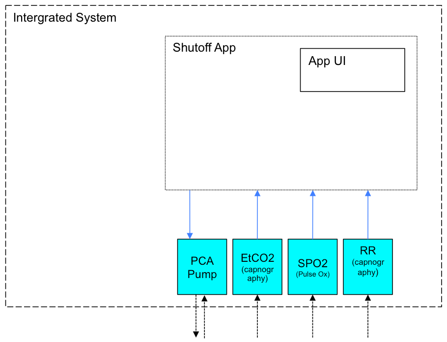

.. MDCF PCA Shutoff App documentation master file, created by
   sphinx-quickstart on Tue Sep  1 14:24:42 2015.
   You can adapt this file completely to your liking, but it should at least
   contain the root `toctree` directive.

.. include:: util/substitution.rst

Welcome to documentation for the MDCF PCA Shutoff App
=====================================================
:author:       `Steve Barrett <http://people.cis.ksu.edu/~scbarrett>`_
:contact:      scbarrett@ksu.edu
:organization: `SAnToS Laboratory <http://santoslab.org>`_, `Kansas State University <http://k-state.edu>`_
:last updated: |today| (`changes <https://github.com/scbarrett/mdcf-adventium/commits/master>`_)

The PCA Shutoff App
*******************
Running on a medical application platform (**MAP**), the *PCA Shutoff 
Application* specifies an interoperable system of medical devices to ensure 
that the system's patient controlled analgesia (PCA) infusion pump will not 
deliver an overdose of narcotic. Should the system's monitoring devices detect
inappropriate physiological responses in the patient under treatment, the
**app** will shut the PCA pump down, thereby preventing further delivery of 
narcotic.

Contents:
*********
.. toctree::
   :maxdepth: 3

   app/overview
   aadl/models

..
   Indices and Tables
   ==================
   * :ref:`genindex`
   * :ref:`search`

.. admonition:: Acknowledgements
   
   The development of the |PCA Shutoff| is supported in part by ??
    
   Any opinions, findings, and conclusions or recommendations expressed in this material are those of the author(s) and do not necessarily reflect the views of the previously mentioned institutions.

.. admonition:: License

   This work is licensed under the |EPL|.
